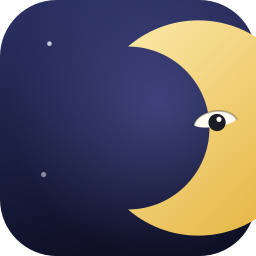

<p align="center">
  
</p>

<h1 align="center">Insomnim</h1>

<p align="center">
  
  =2.2.0" />
  
  <a href="#license"></a>
</p>

<p align="center"><em>Insomnia + Nim</em> — a CLI and menu bar app that keeps macOS awake by talking to IOKit Power Management directly, instead of shelling out to <code>caffeinate</code>.</p>

---

## What this is

Insomnim keeps macOS from idling to sleep (and, optionally, from dimming the
display) for as long as it's running. Rather than spawning `caffeinate` as a
subprocess, it calls `IOPMAssertionCreateWithName` / `IOPMAssertionRelease`
directly. There's no network access at runtime, and nothing is written to
disk.

Both interfaces share the same core logic (`SessionController`) — a CLI and a
menu bar GUI.

|                        | CLI                                                     | GUI                               |
|------------------------|----------------------------------------------------------|-------------------------------------|
| Launch                 | Terminal                                                  | Menu bar, runs in the background    |
| Duration               | Forever / a fixed timeout / while a child process runs    | Forever / 30 min / 1 hour           |
| Prevent display sleep  | `--display`                                               | Toggle checkbox                     |
| Status                 | Printed to stdout                                         | Menu bar icon + remaining time      |
| Language               | `--lang en\|ja\|zh`, or auto-detected from `$LANG`         | Switch live from the menu bar       |

## Features

- **Talks to IOKit directly** — no `caffeinate` subprocess. The CLI alone doesn't even depend on the `darwin` package
- **Ports and Adapters** — `SessionController` only knows about the `InhibitorFactory` / `SleepLease` ports; every macOS detail is isolated under `platform/`
- **Safe cleanup** — `SleepLease.close()` is idempotent; `defer`/`finally` release the assertion on every exit path, including exceptions
- **Acquire-before-release** — reconfiguring while running acquires the new assertion first, so a failure leaves the old state untouched
- **Multi-language UI (en / ja / zh)** — a dependency-free `i18n` module; switching language in the GUI re-renders the menu, status labels, and settings window instantly, no restart needed
- **Deterministic tests** — 17 unit tests driven by a fake inhibitor, with no dependency on real IOKit or wall-clock time

## Requirements

- macOS on Apple Silicon (builds target the local machine's `arm64`)
- [Homebrew](https://brew.sh), then `brew install nim` (Nim >= 2.2.0)
- Xcode Command Line Tools (`codesign` and system headers for the IOKit/AppKit FFI)

## Install

```bash
brew install nim
git clone <this-repo> Insomnim && cd Insomnim
nimble test      # 17 unit tests
```

## Usage

### CLI

```text
insomnim [options]
insomnim --timeout SEC [options]
insomnim [options] -- COMMAND [ARGS...]
```

| Option               | Description                                                      |
|----------------------|--------------------------------------------------------------------|
| `--timeout SEC`       | Stop automatically after SEC seconds                                |
| `--display`           | Also prevent the display from idling to sleep                       |
| `--system-sleep`      | Also request `PreventSystemSleep` (subject to OS limits)            |
| `--reason TEXT`       | Reason string reported to the OS (default: `insomnim (Nim)`)        |
| `--lang LANG`         | UI language: `en`, `ja`, `zh` (default: detected from `$LANG`)      |
| `-- COMMAND ARGS...`  | Inhibit sleep only while COMMAND runs, and return its exit code     |
| `-h`, `--help`        | Show help                                                           |

```bash
# Inhibit indefinitely, until Ctrl+C
insomnim

# 30 minutes, also preventing the display from sleeping
insomnim --timeout 1800 --display

# Only while rsync is running
insomnim -- rsync -av ./src/ backup:/data/

# Force Japanese output regardless of the system locale
insomnim --lang ja --help
```

### GUI

Lives in the menu bar and never shows up in the Dock (`LSUIElement`).

- Click to choose **Forever / 30 minutes / 1 hour**
- Toggle "Also prevent display sleep" with a checkbox (doesn't reset the remaining time)
- The icon *is* the status: a thin crescent moon while stopped, a full "waking" moon (with an eye) while active — the two are meant to be told apart at a glance in a crowded menu bar
- **Language** submenu switches between English / 日本語 / 中文（简体） on the fly, with a checkmark on the active one

## Build & package

```bash
nimble release   # bin/insomnim        (CLI, no darwin package needed)
nimble gui        # bin/insomnim-gui   (GUI, fetches the darwin package)
nimble app         # dist/Insomnim.app (bundled icon, ad-hoc codesigned)
```

> [!NOTE]
> The `.app` produced by `nimble app` is only ad-hoc signed (`codesign --sign -`)
> for local use. There's no Developer ID signature or notarization, so `spctl`
> will reject it. Distributing it to other machines would require enrolling in
> the Apple Developer Program and notarizing the build separately.

## Limitations

> [!NOTE]
> None of these affect the core promise — sleep is inhibited exactly while
> Insomnim says it is, and cleanly released when it stops.

- macOS only (no Windows/Linux support)
- Sleep on lid-close is not guaranteed to be prevented
- GUI settings (including the selected language) are not persisted across restarts
- No protection against running multiple instances; CLI and GUI don't share state
- Built for the local machine's architecture (arm64), not a universal binary
